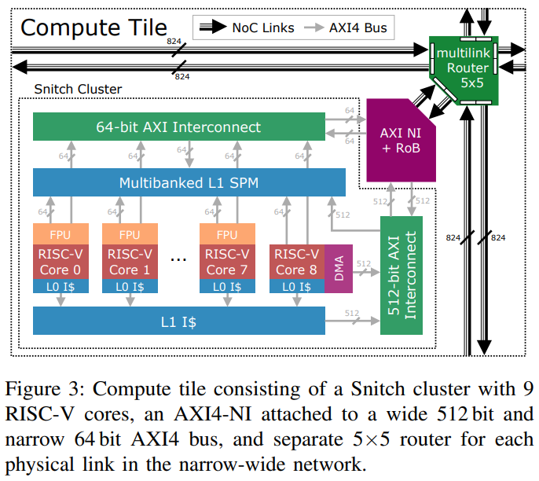
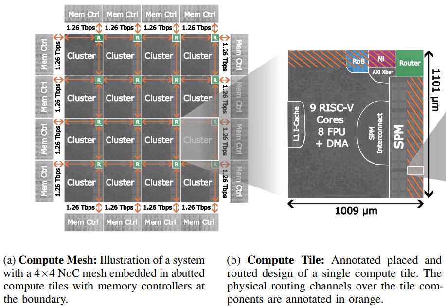
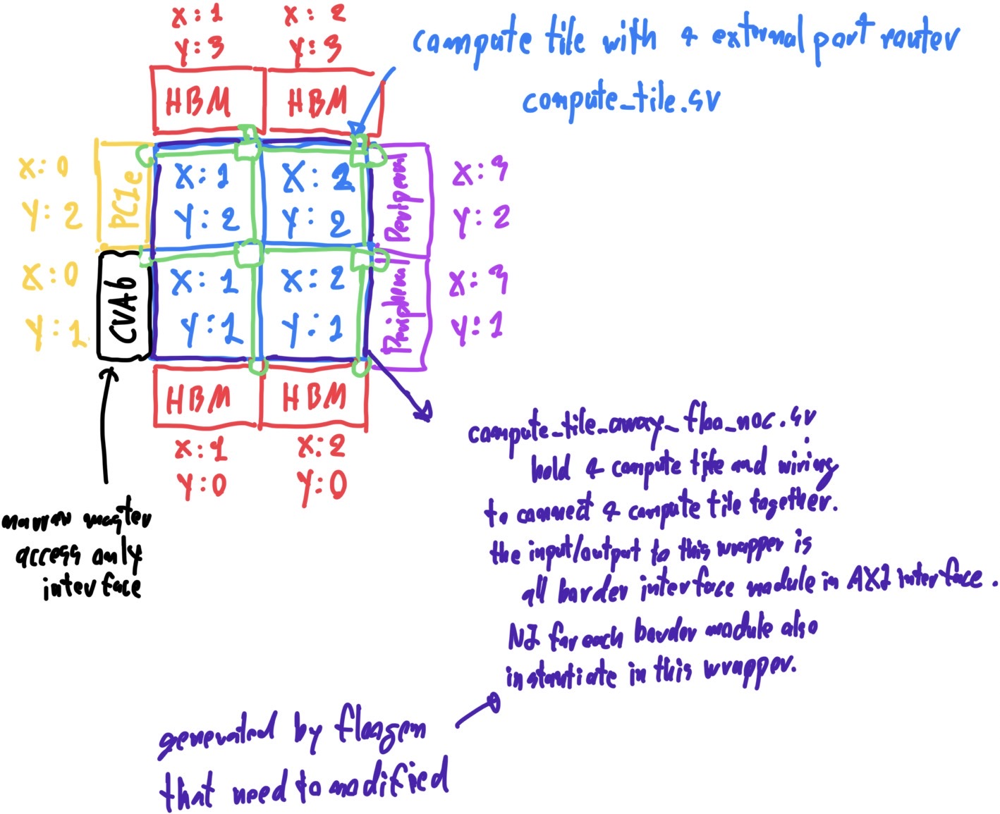
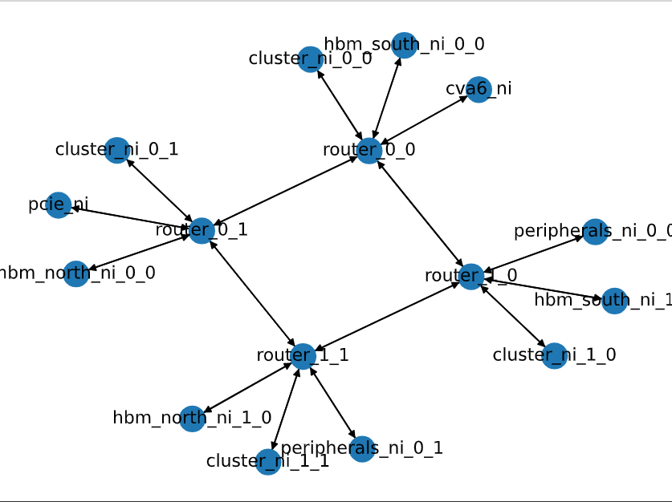

# Compute Tile Array
This document provided a guide to config network and run the simulation with FlooNoC in compute tile array strcuture. Single compute tile have 5 ways router, network interface (NI), and computing cluster grouping together as shown in figure 1.

<div align="center">
  
  <p>Figure 1. single compute tile architecture with snitch cluster connected to the eject port of 5 way router</p>
</div>

The compute tile structure allow a repeat of physical placement as shown in figure 2. where each compute tile can connect together in XY mesh structure, and contain single computing cluster for each compute tile.

<div align="center">
  
  <p>Figure 2. Physical layout of compute tile array connected together in XY mesh topology</p>
</div>

## Getting Start
1. Install floogen. floogen is python package used to generate HDL source code from network configuration file (.yml) where its can install at FlooNoC repos path. This is one time setup if floogen didn't have any change.
```sh
# Install floogen
pip install .
```
In case the above install is not working, plase use Python virtual environment for Python 3.10, and running floogen in virtual environment, instead.
```sh
# Create virtual environment
virtualenv --python python3.10 venv
# Activate virtual environment
source venv/bin/activate

# Install floogen
pip install .
```

2. Generate System Verilog top level wrapper for compute tile array structure that defined network configuration on .yml file using floogen framwork. There is two example network comfiguration in compute tile array structure i.e. "compute_tile_array.yml" and "compute_tile_array_5x4.yml" that are stored in "floogen/examples/" path.

```sh
# Generate system verilog wrapper file using floogen.
# Overwrite default path for [--outdir] and [--pkg-outdir]
floogen -c floogen/examples/compute_tile_array.yml --outdir hw --pkg-outdir hw
```

After running the above command, all file used to run the simulation and syntheis of the network configuration that described in .yml file is ready in the path that bender is pointing to. The detail for each file that generated by floogen is described at table 1. in the next section.

3. Generate DMA jobs file for simulation. The DMA jobs file use to control the DMA simulation behaviour of each snitch cluster test node inside compute tile array. This file is need to generated to control the simulation behaviour of the generated network before running the simulation.

```sh
# Generate DMA jobs file that each snitch cluster will issue read DMA to random HBM or other snitch cluster.
make jobs TRAFFIC_TB=compute_tile_array TRAFFIC_TYPE=random
```

'TRAFFIC_TB' must set to 'compute_tile_array' for working with compute tile array structure. 'TRAFFIC_TYPE' of the above command can be chage from 'random' to other type to change the DMA behaviour, which is described at table 2. in the next section.

4. Running simulation in VCS. In case select between running simulation in batch mode and GUI mode. Verdi is used for interactive debugging in GUI mode. 'TB_DUT' must set to the name of top level testbech, which can be difference in case of 'name' in .yml file is changing. 'JOB_NAME' must set to 'compute_tile_array' for working with compute tile array structure.

To run the simulatin in batch mode :

```sh
# Running simulation in batch mode
make run-vcs-batch TB_DUT=tb_floo_compute_tile_array JOB_NAME=compute_tile_array
```

To run the simulatin in GUI mode :

```sh
# Running simulation in GUI mode
make run-vcs TB_DUT=tb_floo_compute_tile_array JOB_NAME=compute_tile_array
```

To clean auto generated files from VCS simulation result : 

```sh
# Clean auto generated files from running VCS simulation
make clean-vcs
```

## Floogen for Compute Tile Array

floogen is framework use to generate top level wrapper and its belonging from the network configuration file .yml. Normal mode floogen will generate only system verilog top level wrapper and package for synthesis in the structure that instantiate NI and router in top level file without grouping into repeatable placement structure like compute tile array. The compute tile array mode is a special mode from customized floogen that will generate top level wrapper and package for syntheis like normal mode floogen but in the compute tile structure, and its also generate other files ready for simulation as well as support for use ID table in XY routing that normal floogen didn't support. This special mode of floogen can be used by setting some parameter in .yml file following : 

```yaml
compute_tile_gen: true

routing:
  route_algo: "XY"
  use_id_table: true
```

This customized floogen is fully backward compitable to normal mode floogen and the floogen can run in normal mode by setting ```compute_tile_gen: false```, or not declaring ```compute_tile_gen``` in .yml file.

After running floogen command with ```compute_tile_gen: true``` in the network configuration .yml file, the following files as shown in table 1. will be generated.

<div align="center">
  <u>Table 1. list of generated file from floogen in compute tile array mode</u>
</div>

| Name | Flag Path | Default Path | Description |
| --- | --- | --- | --- |
| [compute_tile_array_floo_noc.sv](hw/compute_tile_array_floo_noc.sv) | --outdir | FlooNoC/generated/ | Top level wrapper file that contain all compute tile in the XY mesh array structure, and can be used for synthesis |
| [floo_narrow_wide_pkg.sv](hw/floo_narrow_wide_pkg.sv) | --pkg-outdir | FlooNoC/hw/ | SV package declared for synthesis type and address mapped for each endpoint in the network that is generated for the specific network configuration |
| [tb_floo_compute_tile_array.sv](hw/tb/tb_floo_compute_tile_array.sv) | --tb-outdir | FlooNoC/hw/tb/ | Testbench file that mapped [compute_tile_array_floo_noc.sv] as DUT, and automatically connect HBM simulation model to each border endpoint of 'memory' type. The other type of border endpoint is leave unconnected |
| [compute_tile_array_test_pkg.sv](hw/tb/compute_tile_array_test_pkg.sv) | --tb-outdir | FlooNoC/hw/tb/ | SV package used for HDL simulation only |
| [soc_config.py](util/soc_config.py) | --util-outdir | FlooNoC/util/ | Python file contain address mapped of the specific network configuration to use in generating of DMA jobs file |
| [compute_tile_array.pdf](hw/compute_tile_array.pdf) | --outdir | FlooNoC/generated/ | Generating by adding [--visualize] flag into floogen command. Visualize network connection graph for each router and endpoint |

There is two example network configuration file i.e. [compute_tile_array.yml](floogen/examples/compute_tile_array.yml) and [compute_tile_array_5x4.yml](floogen/examples/compute_tile_array_5x4.yml) that is ready to generate by floogen in the compute tile array mode using the following command : 

```sh
floogen -c floogen/examples/compute_tile_array.yml --outdir hw --pkg-outdir hw --visualize
```

Setting ```--outdir hw --pkg-outdir hw``` is neccesary to generate the result file at the path that bender is already configured to include generated files from floogen for running synthesis/simulation. Otherwise its need to make an editted to [Bender.yml](Bender.yml) to point to the path of the generated files from floogen.

The example network configuration file [compute_tile_array.yml](floogen/examples/compute_tile_array.yml) have 2x2 compute tile and mixed type of endpoint border connected in the structure that is shown in figure 3. This example network configuration have HBM, PCIe and Peripheral connected at the border endpoint of XY mesh. HBMs are fully connected on the north and south border. Single PCIe is connected on the west border. Single CVA6 is connected on the west border. Peripherals are fully connected on the east side of the border. **The XY routing algorithm is used with the ID table.** 

<div align="center">
  
  <p>Figure 3. example network configuration from "floogen/examples/compute_tile_array.yml"</p>
</div>

When generating this network configuration with [--visualize] flag in floogen command, [compute_tile_array.pdf](hw/compute_tile_array.pdf) is generated couple with the System Verilog top level wrapper file. This can used to visualize network configuration to ensure correctness of configuration of .yml file, but its useful only when there is not many endpoint containing in the network. [compute_tile_array.pdf](hw/compute_tile_array.pdf) that generated from [compute_tile_array.yml](floogen/examples/compute_tile_array.yml) is shown in figure 4.

<div align="center">
  
  <p>Figure 4. example network configuration from "floogen/examples/compute_tile_array.yml"</p>
</div>

## Network Configuration
This section given an explanation for each path of network configuration in .yml by taking [compute_tile_array.yml](floogen/examples/compute_tile_array.yml) as an example and floogen running in  compute tile array mode.

First a global scope. Its is not recommended to change ```name: compute_tile_array``` cause this name will be effected on the name of file and that generated by floogen. If its change have been change, [Bender.yml](Bender.yml) need to modify to match with the new name. ```description``` can change to any. ```compute_tile_gen: true``` must set to this value for floogen running in compute tile array mode.

```yaml
name: compute_tile_array
description: "Computile array configuration in XY routing for FlooGen"
compute_tile_gen: true
```

In ```routing``` scope, ```route_algo: "XY"``` and ```use_id_table: true``` must be set to this value for floogen running in compute tile array mode. ```xy_route_opt``` can set to either ```true``` or ```false```, but if its set to ```true```, the routing capability will be limited to allow routing from X direction to Y direction only. To allow routing in all direction needed ```xy_route_opt: false```, but the performance may degraded but its still left in study.

```yaml
routing:
  route_algo: "XY"
  use_id_table: true
  xy_route_opt: false
```

In ```protocols``` scope, its use to config an AXI bus parameter for both narrow and wide interface. To working with compute tile array structure, it require that ```protocols``` need to have ```direction: "manager"``` and ```direction: "subordinate"``` for both narrow and wide interface. ```data_width```, ```addr_width```, and ```id_width``` can be set to any value, but normally its need to match with the setting of Snitch Cluster. Currently, there is no linking with FlooNoC and Snich Cluster repos, so its need to ensure manually that the configuration between FlooNoC and Snitch Cluster Repos is compitible to each other.

```yaml
protocols:
  - name: "narrow"
    type: "AXI4"
    direction: "manager"
    data_width: 64
    addr_width: 48
    id_width: 4
    user_width: 1
  - name: "narrow"
    type: "AXI4"
    direction: "subordinate"
    data_width: 64
    addr_width: 48
    id_width: 2
    user_width: 1
  - name: "wide"
    type: "AXI4"
    direction: "manager"
    data_width: 64
    addr_width: 48
    id_width: 4
    user_width: 1
  - name: "wide"
    type: "AXI4"
    direction: "subordinate"
    data_width: 64
    addr_width: 48
    id_width: 1
    user_width: 1
```

In ```endpoints``` scope, each type of endpoint is declared with the address assignment for each subordinary (slave) endpoint. ```id_offset``` is used to tell the position for placeing each endpoint. For compute tile array, ```name: "cluster"``` with the array size that match with router array size is need to declare to complete compute tile structure, in whihc each compute tile will have one cluster and one router. So, by placing a pair of cluster and router, floogen will interpreted that cluster will connect to Eject port of each router. Only endpoint of border is left flexible to determine, which the example in this case is ```name: "hbm_north"``` that will connect to all router at the north border.

```yaml
endpoints:
  - name: "cluster"
    soc_type: "cluster"
    array: [5, 4]
    addr_range:
      base: 0x0000_1000_0000
      size: 0x0000_0004_0000
    mgr_port_protocol:
      - "narrow"
      - "wide"
    sbr_port_protocol:
      - "narrow"
      - "wide"
    id_offset:
      x: 0
      y: 0
  - name: "hbm_north"
    soc_type: "memory"
    array: [5, 1]
    addr_range:
      base: 0x0000_8000_0000
      size: 0x0000_4000_0000
    sbr_port_protocol:
      - "narrow"
      - "wide"
    id_offset:
      x: 0
      y: 4
```

In ```routers``` scope, this is used to defined the router especially for array size of router. For compute tile array structure, there must be only one router exist in the network configuration.
This router is defined in 2D array, and must have array size match to computing cluster endpoint, which is an array size of ```name: "cluster"``` in this example.

```yaml
routers:
  - name: "router"
    array: [5, 4]
```

In ```connections``` scope, this is used to descried where each endpoint will be connected to each router. For compute tile array structure required that ```src: "cluster"``` and ```dst: "router"``` need to fully connect together in 1 on 1. floogen will automatically connect "cluster" with the Eject port of "router". The other port of router will connecting togher between each neighbor router to complex XY mesh topology. Only the port that have no connection at the border of XY mesh array can connect to other endpoint, which in this example is ```src: "hbm_north"```. ```src_range:``` and ```dst_range:``` is an array index for ```src:``` and ```dst:``` that will be connecting together

```yaml
connections:
  # Each compute cluster (snitch cluster) connect to the router 1 on 1
  - src: "cluster"
    dst: "router"
    src_range:
    - [0, 4]
    - [0, 3]
    dst_range:
    - [0, 4]
    - [0, 3]
    bidirectional: true
  - src: "hbm_north"
    dst: "router"
    src_range:
    - [0, 4]
    - [0, 0]
    dst_range:
    - [0, 4]
    - [3, 3]
    bidirectional: true
```

## Testbench and Simulation
Each computer tile has a single snitch cluster [snitch_cluster_wrapper.sv](hw/cluster/snitch_cluster_wrapper.sv) inside. In the simulation, this snitch cluster will be replaced with a snitch cluster test node [snitch_cluster_test_node.sv](hw/test/snitch_cluster_test_node.sv) which is a simulation model of a snitch cluster to access HBM memory via DMA transfer. Simulation models of DMA controllers ([floo_dma_test_node.sv](hw/test/floo_dma_test_node.sv)) is instantiated in the snitch cluster test node to control DMA behavior inside the snitch cluster for accessing HBM memory that is located outside of the compute tile array. The HBM memory in this simulation also model by using [floo_hbm_model.sv](hw/test/floo_hbm_model.sv) which is a simple simulation behavior of HBM memory and its connect with a top level wrapper of compute tile array in the testbench file.

## DMA Jobs File
[floo_dma_test_node.sv](hw/test/floo_dma_test_node.sv) uses an iDMA module that requires reading DMA jobs files which is DMA traffic description data that describes the behavior of [floo_dma_test_node.sv](hw/test/floo_dma_test_node.sv) in master (initiator) mode when testbench is running. This DMA jobs file use to control the simulation behaviour for FlooNoC network. [gen_jobs.py](util/gen_jobs.py) is a python script that is used to generate DMA jobs file for each snitch cluster test node which has [floo_dma_test_node.sv](hw/test/floo_dma_test_node.sv) inside. 

To create DMA Jobs file from make command :
```sh
make jobs TRAFFIC_TB=compute_tile_array TRAFFIC_TYPE=random
```
The above command is a short command to generated DMA jobs file in DMA read direction (default parameter). ```TRAFFIC_TB=compute_tile_array``` must be set and can't change to run simulation in compute tile array structure. The source and destination of the DMA can be controlled by ```TRAFFIC_TYPE``` parameter.```TRAFFIC_TYPE=random``` is a test mode in which its will generated DMA jobs file, that each snitch cluster will issue DMA command to random other snitch cluster inside XY mesh or HBM memory outside XY mesh. ```TRAFFIC_TYPE``` can be change for chaging the DMA behaviour follow the table 2.

<div align="center">
  <u>Table 2. list of possible 'TRAFFIC_TYPE' to generate DMA jobs file</u>
</div>

| TRAFFIC_TYPE | Description |
| --- | --- |
| hbm | each cluster sends DMA requests to the shortest path hbm memory in XY mesh structure. |
| hbm_rand | each cluster sends DMA requests to random hbm memory in the system. |
| random | each cluster sends DMA requests to another cluster or hbm randomly. |
| cluster_rand | each cluster sends DMA requests to another cluster randomly. |
| onehop | each cluster sends DMA requests to the next cluster or hbm that are located in the north direction of the XY mesh structure. |

## Randomized Traffic Simulation
This section given an instruction to run simulation of the generated FlooNoC network with randomized traffic parameter. The script used to run this is [test_random_compute_tile.sh](util/test_random_compute_tile.sh). Changing simulation parameter need to modify [test_random_compute_tile.sh](util/test_random_compute_tile.sh). The script will repeatedly running simulation with random parameter of AXI burst size, AXI burst length, and number of DMA command. Where its will goto all possible ```TRAFFIC_TYPE```. The randomized simulation is doing the following step repeatedly.

1. Randomized generating of traffic parameter.
2. Generate DMA jobs file from the randomized traffic parameter with ```make jobs```
3. Run simulation on VCS in batch mode with ```make run-vcs-batch```
4. Repeat step 1.

Simulation result will store on "FlooNoC/test/jobs" path. Where the script to get status data from the result file for performance analysis is still not have in currently.

To run this randomized traffic simulation with make command :
```sh
make test-random
```
